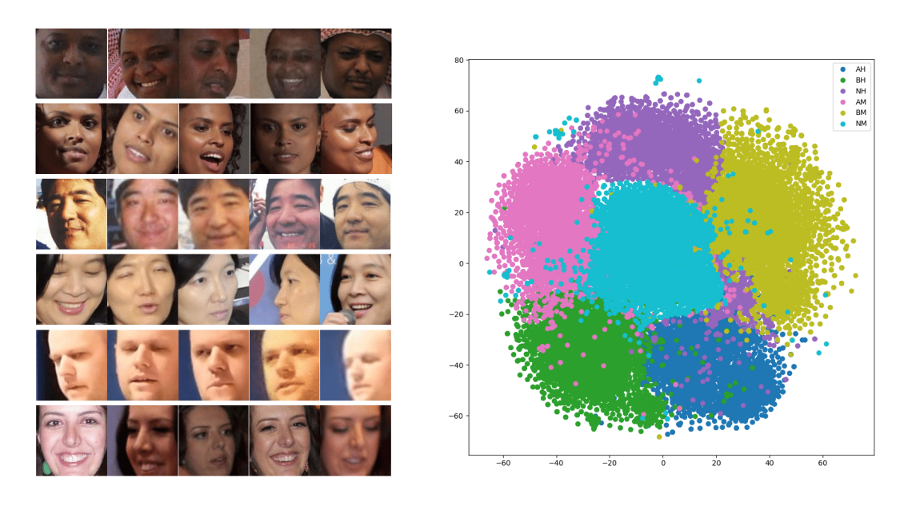

# Biases in Face Recognition Algorithms.

An study on how models that are trained for specific tasks, such as face recognition, can implicitly learn biases such as gender or race from the training data, and how to prevent it.

TSNE over face recognition embeddings. Labels are demographic
groups 

This study was performed using the [diveface dataset](https://github.com/BiDAlab/DiveFace), with a trained-from-scratch vggface model, instead of training over the embeddings in order to do Grad-CAM to visualize activation regions for each classifier.

This is a project for one of my master thesis subjects.

